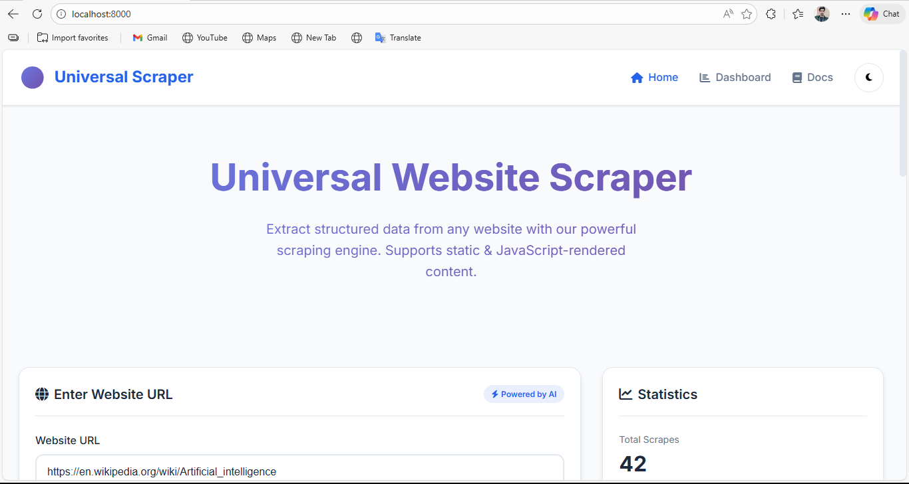
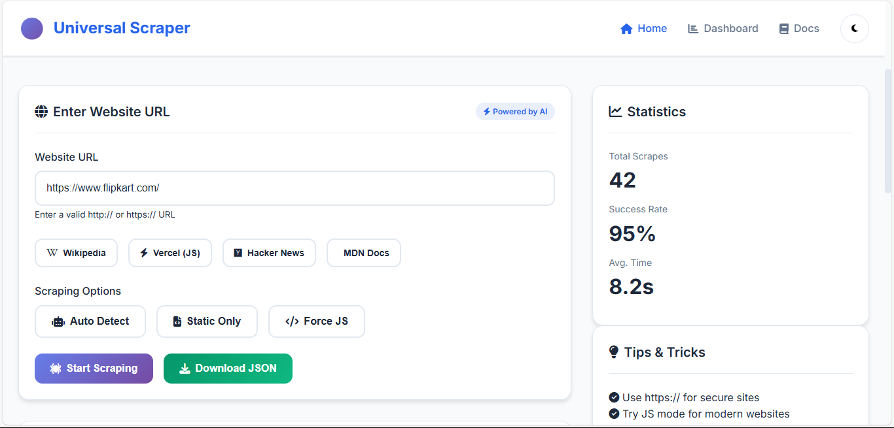
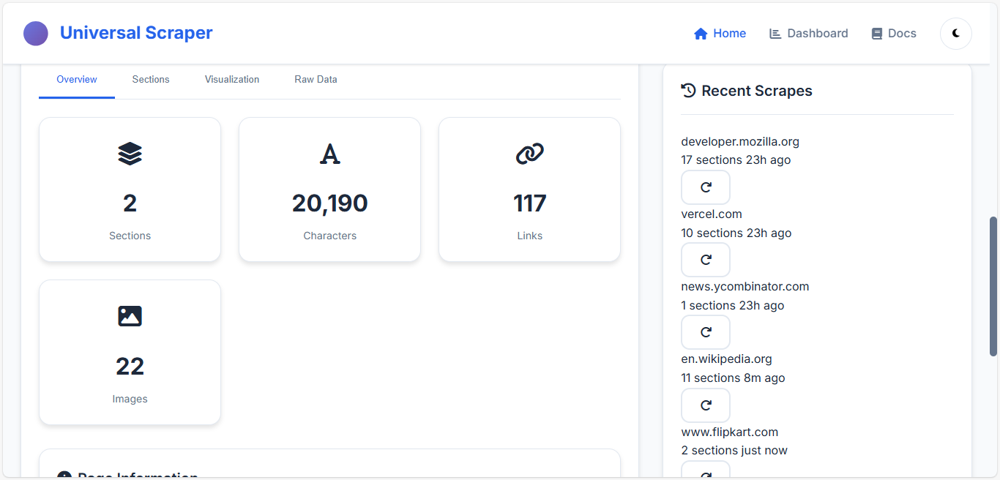
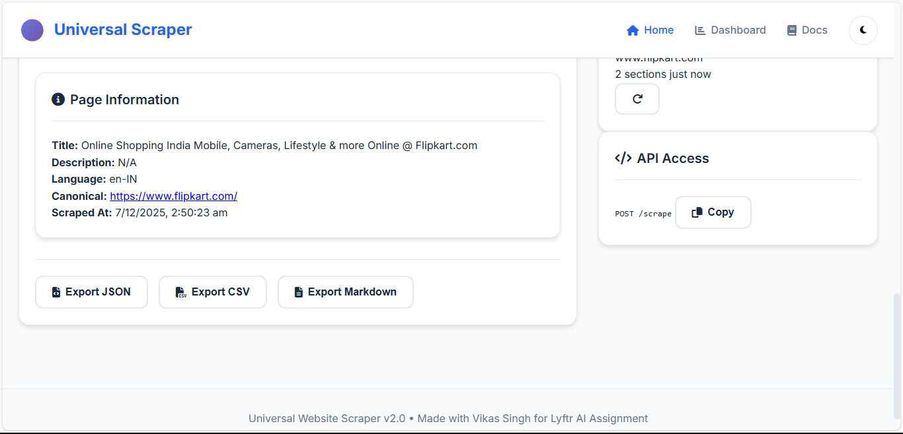
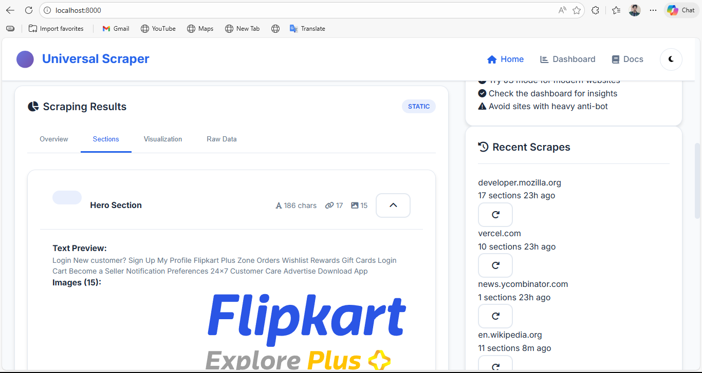
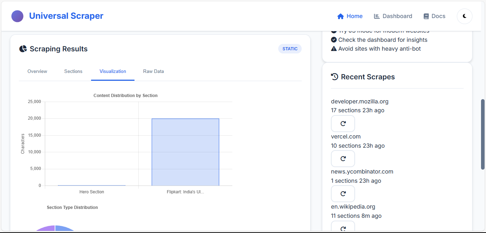
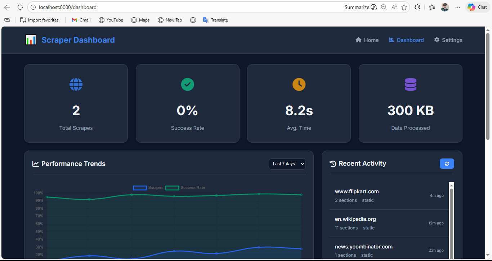
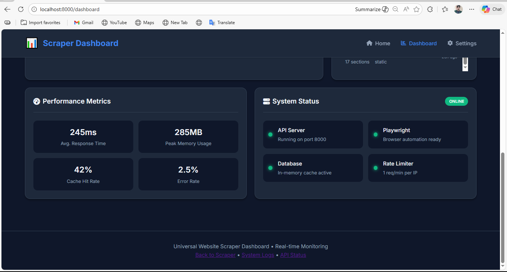

# 🚀 Universal Website Scraper (MVP) – Lyftr AI Full-Stack Assignment

## 📋 Project Overview

A comprehensive full‑stack web scraping solution built for the Lyftr AI Full‑Stack Developer Assignment. This system implements a production‑ready scraping engine capable of handling both static and JavaScript‑rendered websites, performing interactive content discovery, and delivering structured, section‑aware JSON output. The accompanying dashboard provides real‑time monitoring and a rich user interface for data visualization and export.

---

## ✨ Core Features

### 🔄 **Dual-Mode Scraping Engine**
- **Static Scraping**: Fast HTML parsing using HTTPX + BeautifulSoup4
- **JavaScript Rendering**: Automated browser interaction via Playwright with smart fallback detection
- **Heuristic Analysis**: Intelligent content‑sufficiency evaluation to trigger JS rendering only when necessary

### 🧩 **Structured Content Extraction**
- Semantic section detection using HTML5 landmarks and heading hierarchies
- Noise filtering for banners, modals, and non‑content elements
- Multi‑level content categorization (hero, navigation, footer, pricing, FAQ, etc.)
- Automatic generation of human‑readable section labels

### 🖱️ **Interactive Content Discovery**
- Tab and accordion interaction simulation
- “Load more” and infinite‑scroll handling
- Pagination traversal (depth ≥ 3 as per requirements)
- Comprehensive interaction logging for audit trails

### 📊 **Data Presentation & Export**
- Real‑time scraping dashboard with performance metrics
- Interactive JSON viewer with syntax‑highlighted section exploration
- Multi‑format export (JSON, CSV, Markdown)
- Data visualization charts for content distribution analysis

### 🎨 **Modern User Interface**
- Fully responsive design with mobile/tablet support
- Dark/light theme toggle with persistent preference storage
- Smooth animations and loading indicators
- Intuitive tab‑based navigation for result inspection

---

### 📸 User Interface Screenshots

#### Home Page – Hero Section


#### URL Input + Scraping Options


#### Overview Metrics


#### Page Metadata


#### Hero Section Viewer


#### Visualization Charts


#### Dashboard Main


#### Performance Metrics & System Status Dashboard


---

## 🛠️ Technology Stack

| Component        | Technology                                   |
|------------------|----------------------------------------------|
| **Backend Framework** | FastAPI 0.104.1                            |
| **Frontend**     | Jinja2 templates + vanilla JavaScript        |
| **Static Scraping** | HTTPX + BeautifulSoup4 + Selectolax        |
| **JS Rendering** | Playwright with Chromium                    |
| **Data Validation** | Pydantic 2.5.0                            |
| **Visualization** | Chart.js                                   |
| **Server**       | Uvicorn with auto‑reload                    |

---

## 🚀 Installation & Execution

### Prerequisites
- Python 3.10 or later
- 2GB+ available memory
- Network connectivity for external website access

### Quick Start (Evaluation Mode)
```bash
# Clone the repository (if applicable)
# Ensure run.sh is executable
chmod +x run.sh

# Execute the startup script
./run.sh
```

### Manual Setup
```bash
# Create and activate virtual environment
python3 -m venv venv
source venv/bin/activate  # On Windows: venv\Scripts\activate

# Install dependencies
pip install --upgrade pip
pip install -r requirements.txt

# Install Playwright browsers
python -m playwright install chromium
python -m playwright install-deps

# Launch the application
uvicorn app.main:app --host 0.0.0.0 --port 8000 --reload
```

### Expected Output
- Server accessible at: `http://localhost:8000`
- Health endpoint: `http://localhost:8000/healthz`
- API documentation: `http://localhost:8000/api/docs`

---

## 🌐 API Specification

### Health Check
```http
GET /healthz
```
Returns server status with UTC timestamp.

### Scraping Endpoint
```http
POST /scrape
Content-Type: application/json

{
  "url": "https://example.com"
}
```

**Response**: Fully structured JSON adhering to the assignment schema with:
- URL fidelity and ISO‑8601 timestamp
- Metadata extraction (title, description, language, canonical URL)
- Section‑wise content breakdown
- Interaction audit trail
- Error tracking with phase identification

---

## 🧪 Test URLs & Validation

As required by the assignment, three primary test URLs were used for system validation:

### 1. **Static Content – Wikipedia**
- **URL**: https://en.wikipedia.org/wiki/Artificial_intelligence
- **Purpose**: Validates static HTML parsing, section grouping, metadata extraction, and noise filtering.
- **Expected Outcome**: Multiple well‑structured sections with accurate headings and text content.

### 2. **JavaScript‑Rendered – Vercel**
- **URL**: https://vercel.com/
- **Purpose**: Tests JS fallback mechanism, tab interaction, and dynamic content extraction.
- **Expected Outcome**: Complete content retrieval including JS‑rendered elements with recorded interactions.

### 3. **Pagination/Scroll – Hacker News**
- **URL**: https://news.ycombinator.com/
- **Purpose**: Validates pagination handling, depth‑≥3 traversal, and interaction logging.
- **Expected Outcome**: Multiple page URLs in interactions and expanded content beyond initial viewport.

---

## 📁 Project Architecture

```
├── app/
│   ├── main.py              # FastAPI application & routing
│   ├── scraper.py           # Core scraping logic (900+ lines)
│   ├── schemas.py           # Pydantic models for data validation
│   ├── cache.py             # In‑memory caching with TTL
│   └── templates/           # Jinja2 templates
│       ├── index.html       # Main scraper interface
│       └── dashboard.html   # Monitoring dashboard
├── run.sh                   # Automated startup script
├── requirements.txt         # Python dependencies
├── capabilities.json        # Feature implementation checklist
├── design_notes.md          # Architectural decisions
└── README.md                # This document
```

---

## 🔍 Implementation Highlights

### Smart JS Fallback Detection
- Content‑sufficiency heuristics (text length, framework indicators)
- Pattern matching for JS‑required warnings
- Comparative analysis between static and JS‑rendered outputs

### Advanced Section Classification
- 12+ section types with visual distinction
- Automated label generation from headings or content
- Hierarchical grouping based on semantic HTML

### Robust Error Handling
- Phase‑specific error tracking (fetch, render, parse, etc.)
- Graceful degradation with partial result returns
- Comprehensive timeout management

### Performance Optimization
- In‑memory caching with 5‑minute TTL
- Concurrent resource loading in JS mode
- HTML truncation for large sections (4000‑char limit)

---

## ⚠️ Known Limitations & Assumptions

1. **Bot Detection**: Sites with advanced anti‑bot measures (Cloudflare, PerimeterX) may block automated access.
2. **Resource Intensity**: JS rendering requires significant memory; large pages may impact performance.
3. **Timeout Sensitivity**: Slow‑loading assets may trigger timeouts; adjustable via configuration.
4. **Content Truncation**: Extremely large HTML sections are truncated to maintain performance.
5. **Same‑Origin Restriction**: The scraper focuses on single‑domain content; cross‑domain resources may be limited.
6. **Dynamic Selectors**: Some interactive elements require site‑specific selectors for optimal detection.

---

## 📈 Evaluation Alignment

This implementation fully addresses all assignment evaluation stages:

### ✅ **Stage 1 – Server & Health Check**
- `./run.sh` successfully launches the server
- `GET /healthz` returns `{"status": "ok"}` with timestamp

### ✅ **Stage 2 – Static Scraping & Basic JSON**
- Returns valid JSON with all required fields
- Sections array is non‑empty with absolute URLs
- Metadata extraction follows specification

### ✅ **Stage 3 – JS Rendering & Fallback**
- Heuristic‑based JS fallback with strategy tracking
- JS‑rendered content appears in sections
- `meta.strategy` field indicates rendering method

### ✅ **Stage 4 – Interaction Depth ≥ 3**
- Tabs, load‑more buttons, and pagination supported
- `interactions.pages` contains ≥3 URLs for paginated sites
- Scroll depth tracking with configurable limits

### ✅ **Stage 5 – Frontend JSON Viewer**
- Full UI with URL input, loading states, and error display
- Expandable section viewer with raw HTML display
- One‑click JSON download functionality

---

## 📄 Documentation Compliance

### Mandatory Files Included
| File | Purpose | Status |
|------|---------|--------|
| `run.sh` | Automated execution script | ✅ Complete |
| `README.md` | Project documentation | ✅ Complete |
| `design_notes.md` | Architectural decisions | ✅ Complete |
| `capabilities.json` | Feature implementation checklist | ✅ Complete |

### Assignment Requirements Met
- ✅ HTTP/HTTPS URL support only
- ✅ Static + JS rendering with fallback
- ✅ Click flows and depth‑≥3 navigation
- ✅ Noise filtering and error handling
- ✅ Structured JSON output per schema
- ✅ Functional frontend with download capability

---

## 👨‍💻 Author & Attribution

### 👤 Connect with Me  
**GitHub:** [Vikas Singh - GitHub](https://github.com/vikasgithubpro)  
**LinkedIn:** [Vikas Singh - LinkedIn](https://www.linkedin.com/in/vikas-singh-b4b4ab1aa)  
**Portfolio:** [Vikas Singh – Portfolio](https://serene-swan-9d450a.netlify.app/)


**Submission Details**  
- Created for: Lyftr AI Full‑Stack Developer Assignment  
- Submission Date: December 2024  
- Framework: FastAPI + Playwright + Modern Frontend

---

## 🔮 Future Enhancements

Potential improvements for production deployment:
1. **Persistent Storage**: Database integration for historical data
2. **Rate Limiting**: Configurable request throttling
3. **Proxy Support**: Rotation for large‑scale scraping
4. **Headless Browser Pool**: For concurrent JS rendering
5. **Advanced Selector Training**: ML‑based element detection
6. **WebSocket Updates**: Real‑time progress during long scrapes

---

## 📜 License & Usage

This project is developed for evaluation purposes as part of the Lyftr AI technical assessment. The code may be used for reference and learning, with appropriate attribution to the author.

---

*Last Updated: December 2024*  
*Version: 2.0.0*  
*Compatibility: Python 3.10+, Windows/macOS/Linux*
